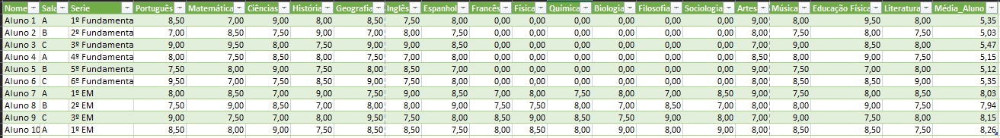

# Projeto_Notas_Escolares_IA_GEMINI
## Projeto Desafio da Imersão GEMINI + ALURA

# Introdução

Esse é o primeiro projeto que faço do Python e Colab na prática, já tinha um breve conhecimento na área, mas essa imersão me mostrou um mundo novo de possibiliades do uso da IA GEMINI e Colab.


# Descrição:

O meu projeto consiste em uma analise de planilha de notas de um escola, e retorna quais alunos tiveram as menores notas no geral, em cada materia e da um resumo para cada uma dessa materias para que possa ser feita uma aula direcionada as materias em deficit.

Observação:
É importante notar que, para os alunos do Fundamental I (1º ao 5º ano), algumas matérias como Física, Química, Biologia, Filosofia, Sociologia etc., não são oferecidas, portanto, possuem  nota 0,00. Isso não significa necessariamente que o aluno teria baixo desempenho nessas áreas.
A análise se baseia apenas nas médias gerais e nas notas individuais. Outros fatores, como o contexto individual do aluno, o nível de dificuldade da turma e da escola, entre outros, também podem ser relevantes para uma avaliação mais completa.


**Instalação inicial das bibliotecas e configurações de API_KEY**
```
!pip install -q -U google-generativeai
# Importar a Python SDK
import google.generativeai as genai

# Uso Seguro da API_KEY
from google.colab import userdata
api_key = userdata.get('Secret_Key')
genai.configure(api_key=api_key)

#Calulos Matematicos e Manipulação de DataFrames
import numpy as np
import pandas as pd

# Entrada de Dados
from google.colab import files
from pathlib import Path
import os
import io
```

Definindo parametros da para a IA

```
generation_config = {
    "candidate_count": 1,
    "temperature": 1,
}

safety_settings = {
    "Harassment": "BLOCK_NONE",
    "Hate": "BLOCK_NONE",
    "Sexual": "BLOCK_NONE",
    "Dangerous": "BLOCK_NONE",
}
```
Selecionando a versão utilizada no modelo e setando os parâmentros
```
model = genai.GenerativeModel (model_name='gemini-1.5-pro-latest',
                               generation_config=generation_config,
                               safety_settings=safety_settings)
```
Base de Entrada da Planilha

*   Serie sendo de 1º Fundamental a 3º Medio
*   Salas sendo de A, B ou C
*   Materia podenendo ser Colocadas de acordo com a necessidade do professor

*   **Lembrete: As medias do alunos de ensino fundamental, serão diferentes por terem menos materias que no ensimo médio**  
Exemplo 1:

Exemplo 2:


**Todas as informações fora geradas pelo Gemini e são fictícias**.

Subindo o Arquivo **CSV** das notas dos alunos e Transformando em DataFrame
```
#Exluir Arquivos Anteriores
arquivos_para_manter = ['.config', 'sample_data']

for filename in os.listdir('/content'):
  if filename not in arquivos_para_manter:
    caminho_completo = os.path.join('/content', filename)
    if os.path.isfile(caminho_completo):
      os.remove(caminho_completo)
      print(f"Arquivo '{filename}' excluído.")
    else:
      print(f"'{filename}' não é um arquivo.")

# Carrega o arquivo das Notas
uploaded = files.upload()

df_notas = pd.read_csv(list(uploaded.keys())[0])

# Preenche as áreas vazias com 0
df_notas = df_notas.fillna(0)
df_notas

```
Converti as Colunas em Numericas para não dar erro no momento de calcular as médias. Deixando somente as três de cabeçalho como texto
```
# Seleciona as colunas que não devem ser numéricas
colunas_numericas = df_notas.columns[3:]

# Converte as colunas selecionadas para numéricas
df_notas[colunas_numericas] = df_notas[colunas_numericas].apply(pd.to_numeric, errors='coerce')
df_notas.dtypes
```
**Analise do Data Frame**


*   Encontrar os 3 Aluno com a menor nota geral.
*   Encontrar qual a materia e sala que teve a menor nota.


```
# Substitui valores vazios por 0
df_notas = df_notas.fillna(0)
menor_nota = np.nanmin(df_notas.iloc[:, 3:].values)

# Cria uma coluna "Nota Geral" com a média das notas
df_notas['Nota Geral'] = df_notas.iloc[:, 3:].mean(axis=1)

# Ordena o DataFrame pela "Nota Geral" e pega os 3 alunos com as menores notas
alunos_menor_nota = df_notas.sort_values(by='Nota Geral').head(3)

# Exibe os alunos com a menor nota geral em ordem alfabetica por nome
print("3 Alunos com Menor Nota Geral:")
alunos_menor_nota = alunos_menor_nota.sort_values(by='Nome')
print(alunos_menor_nota[['Nome', 'Nota Geral']].round(2))

# Encontra a menor nota no DataFrame
menor_nota = df_notas.iloc[:, 3:].min().min()

# Encontra a matéria e sala com a menor nota
materia_menor_nota = df_notas.iloc[:, 3:].min().idxmin()
sala_menor_nota = df_notas[df_notas[materia_menor_nota] == menor_nota]['Sala'].iloc[0]

# Encontra a matéria e sala com a menor nota
materia_menor_nota = df_notas.iloc[:, 3:].min().idxmin()
sala_menor_nota = df_notas[df_notas[materia_menor_nota] == menor_nota]['Sala'].iloc[0]
serie_menor_nota = df_notas[df_notas[materia_menor_nota] == menor_nota]['Serie'].iloc[0]

print("\nMatéria com Menor Nota:", materia_menor_nota)
print("Sala com Menor Nota:", sala_menor_nota)
print("Serie com Menor Nota:", serie_menor_nota)


# Substitui valores vazios por 0
df_notas = df_notas.fillna(0)

# Calcula a média por matéria
medias_materias = df_notas.iloc[:, 3:].mean()
menor = medias_materias[-2]
nome_materia = medias_materias.index[-2]

# Cria uma coluna "Nota Geral" com a média das notas
df_notas['Nota Geral'] = df_notas.iloc[:, 3:].mean(axis=1)

# Ordena o DataFrame pela "Nota Geral" e pega os 3 alunos com as menores notas
alunos_menor_nota = df_notas.sort_values(by='Nota Geral').head(3)

# Exibe os alunos com a menor nota geral
print("\n3 Alunos com Menor Nota Geral:")
print(alunos_menor_nota[['Nome', 'Nota Geral']].round(2))

# Encontra a menor nota no DataFrame
menor_nota = df_notas.iloc[:, 3:].min().min()


print(f"A matéria '{nome_materia}' tem a penúltima menor média, com valor {menor:.2f}.(Ultimo é a Média Geral)")


#-------------------------------------------------

# Criando uma lista para armazenar as médias das séries
medias_por_serie = []

# Iterando sobre as séries únicas no DataFrame
for serie in df_notas['Serie'].unique():
    # Filtrando o DataFrame para obter apenas os alunos da série atual
    alunos_serie = df_notas[df_notas['Serie'] == serie]
    # Calculando a média das notas de todas as matérias para a série atual
    media_serie = alunos_serie.iloc[:, 3:].mean().mean()
    # Adicionando a média da série à lista
    medias_por_serie.append(media_serie)

# Encontrando a menor média
menor_media = min(medias_por_serie)

# Encontrando os índices das séries com a menor média
indices_series_menor_media = [i for i, media in enumerate(medias_por_serie) if media == menor_media]

# Encontrando os nomes das séries com a menor média
series_menor_media = df_notas['Serie'].unique()[indices_series_menor_media].tolist()


print("Séries com a Menor Média:", series_menor_media)
```
Define qual será a entrada do Prompt do Gemini


```
prompt = f"""
A menor nota encontrada foi {menor:.2f} na matéria {nome_materia} do ({serie_menor_nota}).
```
Crie um relatório completo sobre o desempenho dos alunos, destacando os alunos com dificuldades e as áreas que precisam de mais atenção. Inclua também sugestões de como melhorar o desempenho geral da turma.
"""
```
print(prompt)

response = model.generate_content(prompt)
print(response.text)
```


# Resultado Obtido ao final do Projeto: (Com o CSV anexado)


" ## Relatório de Desempenho em Literatura - 1º Ano do Ensino Fundamental

**Introdução:**

Este relatório analisa o desempenho da turma do **1º Ano do Ensino Fundamental** na disciplina de **Literatura**, com foco na menor nota registrada: **7,95**. O objetivo é identificar alunos com dificuldades, áreas que requerem atenção e sugerir estratégias para melhorar o desempenho geral da turma.

**Análise da Menor Nota:**

A nota 7,95, sendo a mais baixa, indica que pelo menos um aluno necessita de atenção individualizada. É crucial entender o contexto dessa nota:

* **Representatividade:** Essa nota é um caso isolado ou reflete um padrão na turma? Quantos alunos tiveram notas próximas a essa?
* **Critérios de avaliação:** O que a avaliação cobrou? A nota reflete dificuldades em leitura, interpretação, criatividade ou outros aspectos?
* **Fatores externos:**  Existem fatores externos que podem ter impactado o desempenho do aluno, como questões socioemocionais, dificuldades de aprendizagem ou falta de apoio familiar?

**Identificação de Alunos com Dificuldades:**

É necessário ir além da menor nota e analisar o desempenho individual de cada aluno. Identificar alunos com dificuldades em leitura, interpretação textual, desenvolvimento da escrita criativa e outros aspectos relacionados à disciplina. 

**Áreas que Requerem Atenção:**

As áreas que precisam de atenção dependem da análise das dificuldades dos alunos. Alguns exemplos:

* **Compreensão Leitora:** Se a dificuldade reside na compreensão, atividades que estimulem o desenvolvimento da leitura, interpretação e vocabulário são essenciais.
* **Escrita Criativa:** Se a dificuldade reside na escrita, atividades que estimulem a criatividade, imaginação e expressão escrita podem ser implementadas.
* **Participação em Aula:** Se a dificuldade reside na participação, estratégias que promovam um ambiente seguro e encorajador para a expressão dos alunos são importantes.

**Sugestões para Melhorar o Desempenho da Turma:**

* **Atividades Diferenciadas:** Diversificar as atividades para atender os diferentes estilos de aprendizagem e níveis de compreensão dos alunos.
* **Recursos Didáticos Variados:** Utilizar livros infantis, contação de histórias, teatro, músicas e jogos para tornar o aprendizado mais dinâmico e interessante.
* **Avaliações Formativas:** Implementar avaliações frequentes e variadas para acompanhar o progresso dos alunos e identificar as dificuldades precocemente.
* **Feedback Individualizado:** Fornecer feedback específico para cada aluno, focando em seus pontos fortes e áreas a serem aprimoradas.
* **Comunicação com Pais:** Manter os pais informados sobre o desempenho dos alunos e trabalhar em conjunto para oferecer o suporte necessário.

**Conclusão:**

Com base na análise do desempenho individual dos alunos, na identificação das áreas que requerem atenção e na implementação das sugestões de melhoria, é possível promover um ambiente de aprendizagem mais eficaz e engajador,  contribuindo para o desenvolvimento integral dos alunos na disciplina de Literatura.

**Próximos Passos:**

* Analisar detalhadamente o desempenho individual de cada aluno.
* Realizar uma reunião com os pais para discutir as dificuldades dos alunos e traçar estratégias em conjunto.
* Implementar as sugestões de melhoria e acompanhar o desenvolvimento da turma ao longo do semestre.

Este relatório serve como ponto de partida para uma análise mais aprofundada do desempenho da turma. É essencial que o professor utilize as informações aqui contidas para embasar suas decisões pedagógicas e oferecer um ensino de qualidade para todos os alunos. "
